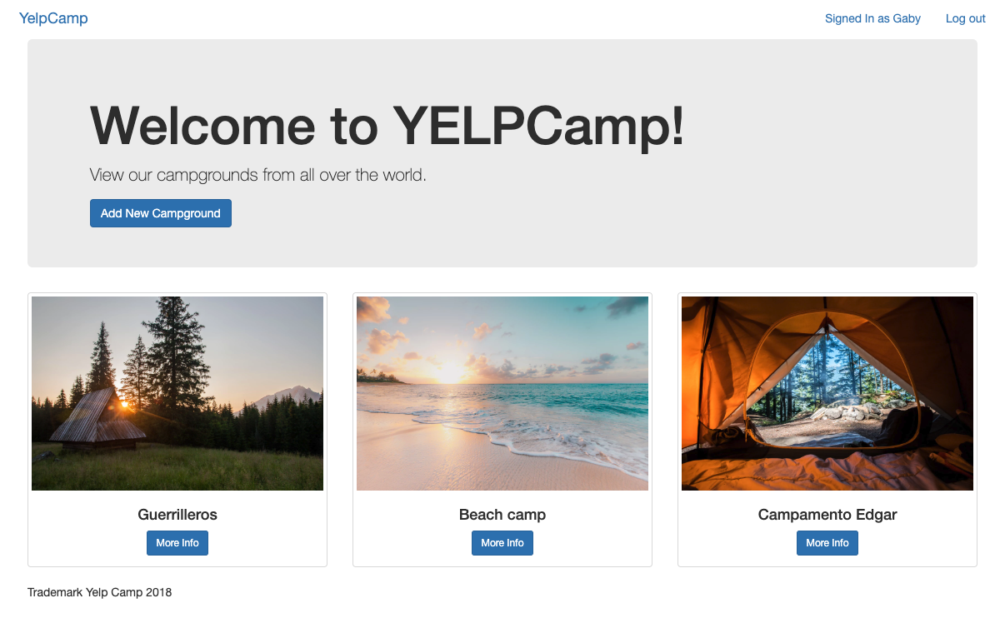
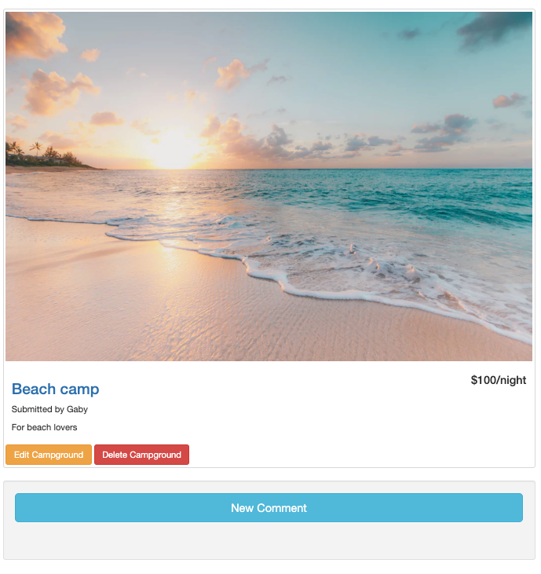

# CRUD-campsite :tent:

This project is a CRUD web app built in node, passport, express and mongo. Its the final project of a web developer course in udemy.  

Index view of the project:

View of all campgrounds once logged in.

The detailed view of a single campground, if the user owns the campground he can edit and delete the campground. Users can also leave comments as well.

Edit view of a campground.

## Installation

Clone project and on terminal: 

    npm install

You must have mongo service running locally, so in a separate terminal run:

    mongo

Finally run in the project folder

    npm start
 
 You should see in terminal 
 
    Yelp Camp started in port 8000
    
Finally open http://localhost:8000/ in browser.   

##### Enjoy CRUD operations !!!!!
